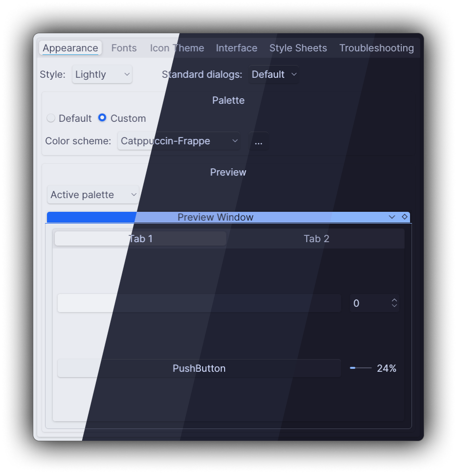
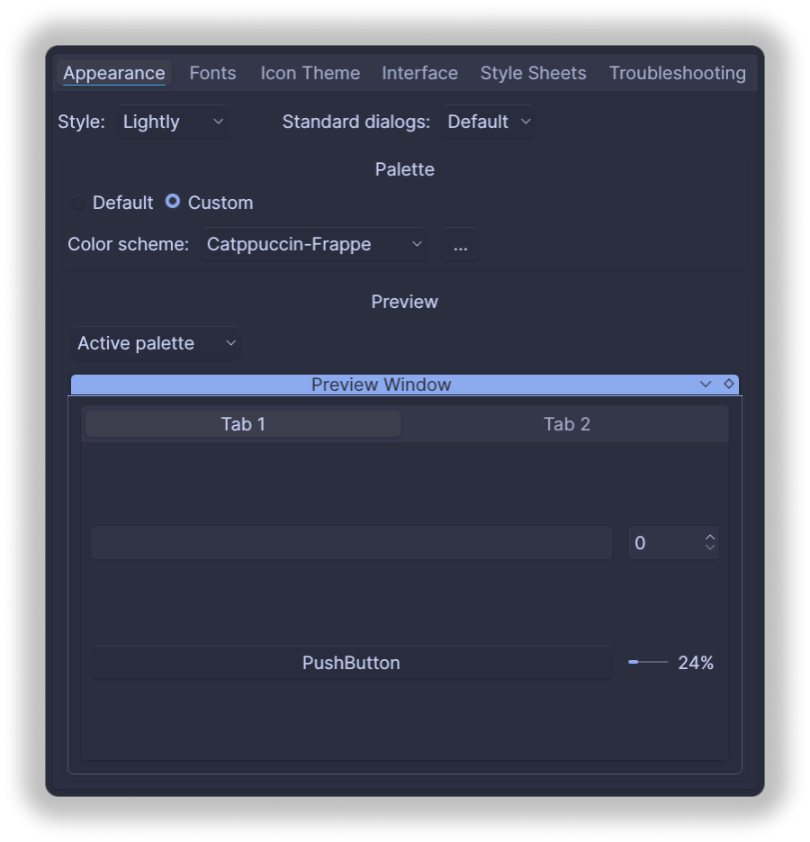
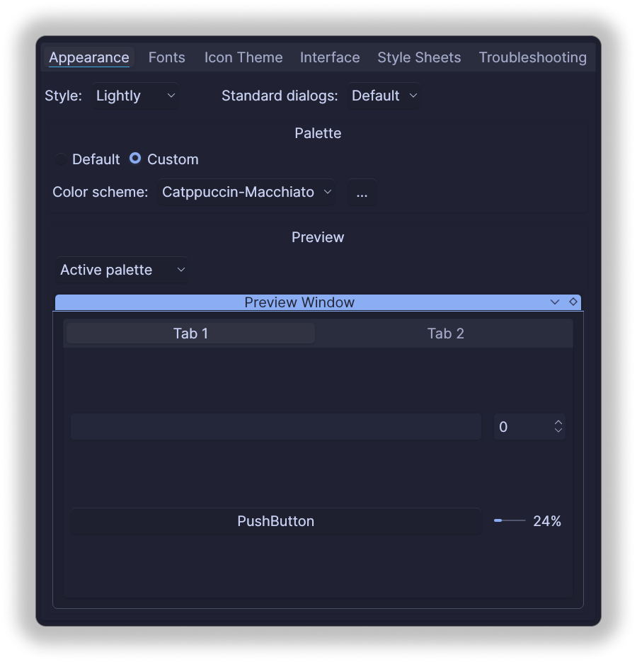
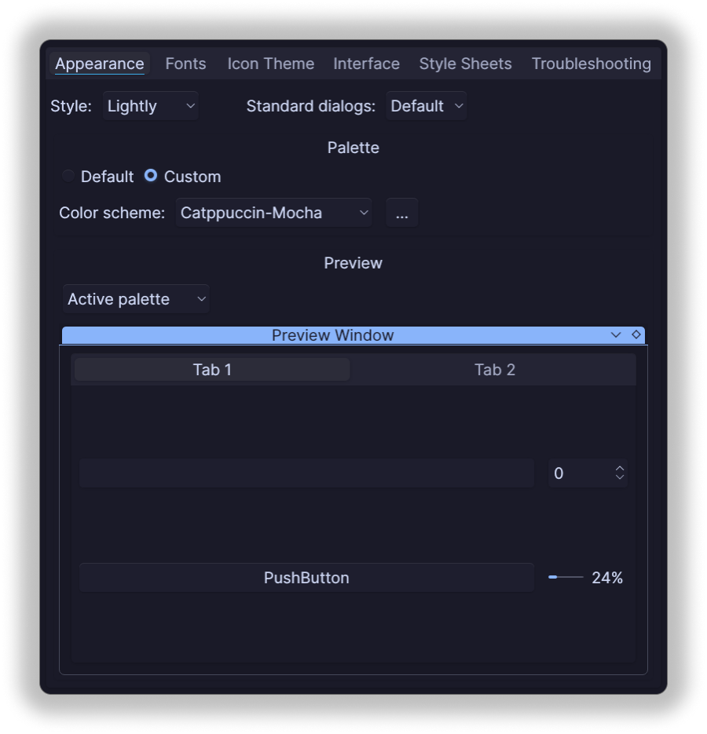

<h3 align="center">
	 
	
	Catppuccin for <a href="https://github.com/desktop-app/qt5ct">qt5ct</a>
	
</h3>

	
	
	

	

## Previews

🌻 Latte

 

🪴 Frappé

 

🌺 Macchiato

 

🌿 Mocha

 

## Usage

1. Clone this repository locally
2. Copy your favorite color scheme (For example: `Catppuccin-Mocha.conf`) in the folder `~/.config/qt5ct/colors/` (Create the folder if it doesn't exist)
3. Open qt5ct and select custom as your pallete provider.
4. Select the color scheme you copied from the dropdown menu and hit apply.

## 🙋 FAQ (optional)

-	Q: **_"Can I change the accent color?"_**\
	A: Yes, it is possible to change the accent color. You will need to click the three dots button (•••) besides the theme selection dropdown menu and select edit theme, then scroll down and change the `Highlight` color for **only the Active part.**

-	Q: **_"How can I make it look like the one in the screenshots?"_**\
	A: You will need to install [Lightly](https://github.com/Luwx/Lightly) as the application style and then change the style to Lightly in qt5ct.

## 💝 Thanks to

- [Syndrizzle](https://github.com/syndrizzle)

&nbsp;

	

	Copyright &copy; 2021-present <a href="https://github.com/catppuccin" target="_blank">Catppuccin Org</a>

	

